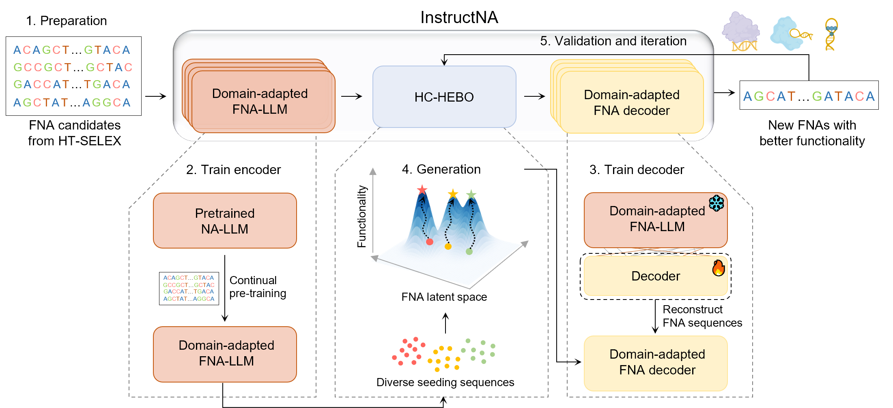

# InstructNA

InstructNA is a framework to generate functional nucleic acids. 

# Setup

We recommend using docker for a quick start. You can launch an instance of instructNA with the following commands:

`docker pull crpi-atf4jrwl4g72ynlk.cn-hangzhou.personal.cr.aliyuncs.com/zhiming_hub/instructna:v1`

# Usage

The prior sequence comes from diverse resources: (1) SELEX frequency top 10 sequence (2) sequences generated from the SELEX data's GMM center (3) the sequence in SELEX whose embedding near the high functional sequence from (1) and (2)

After get the prior sequence and its function, we can generated sequence by following code:

`python examples/inference.py \`

`--data_dir 			The SELEX data path`

`--model_name_or_path  		The trained Domain-adapted FNA-LLM path`

`--decode_model_name_or_path	The InstructNA model path ( including encoder and decoder)`	

`--Kd_seq_path			The sequences with fucntion file path ,the file is .csv file and formate is "ACTGGACTGGACTGGACTGG,12.3",which means the sequence ACTGGACTGGACTGGACTGG and its fucntion `

`--Kd_seq_data_dir		The sequences in Kd_seq_path that been seperated with 3mers like ACT CTG TGG...			` 

`--seq_len 			The length of the DNA's sequence`					 					` `

`--label_dir			The PBM labels data dir`					``

`--f_linker			The forward linker`					

`--r_linker			The reverse linker`
